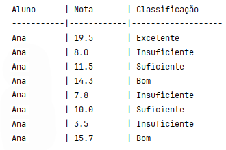

# Lab 4 (1) - Linguagem Java (Sintaxe). Funções arrays e matrizes.

:warning: O Lab 4 é composto por :two: enunciados:

1. Lab 4 (1), este enunciado; exercícios 1, 2 e 3. 
2. Lab 4 (2), disponível em: <https://github.com/estsetubal-ipoo-2024-25-labs/Lab4_2>.

## Aplicações Java 

:dart: Desenvolva os seguintes programas com recurso ao IDE `IntelliJ IDEA`, criando um novo projeto (e.g. `Lab4`).

:warning: Crie os diferentes programas em _classes_ separadas.

:warning: Não se esqueça de guardar o seu trabalho!  

## Exercícios :pen:

1. Crie um programa (`AnalyseNumber`) que solicite um número inteiro ao utilizador e analise várias opções.

   :pencil2: Defina uma função  (`menu`) que exibe um menu com 3 opções e o utilizador só pode escolher uma das opções. A opção (numérica) escolhida pelo utilizador deverá ser devolvida pela função.

      ```console
      1 - Verificar se um número é par
      2 - Verificar se um número é primo
      3 - Sair
      
      Escolha uma opção: 
      ```

    :pencil2: No programa principal este _menu_ deverá ser invocado e a opção escolhida tratada adequadamente. Utilize um ciclo para repetir a mostragem/processamento do menu até que a opção 'sair' seja selecionada.

    - :bulb: Faça uso da instrução **switch** para tratar a escolha do utilizador.

    - :bulb: Para cada opção do menu deve ser invocada uma função específica que realiza a verificação pretendida (terá de desenvolvê-las também).

---

2. Crie um programa (`GradesList`) solicite ao utilizador um conjunto de 8 notas de um(a) estudante e que as apresente quantitativa e qualitativamente de forma tabulada. O nome do(a) estudante deverá também ser solicitado.

    Cada nota é classificada como:

    ```
    Excelente: nota >= 18.0
    Bom: 14.0 <= nota < 18.0
    Suficiente: 10.0 <= nota < 14.0
    Insuficiente:  nota < 10.0
    ```

    :pencil2: Defina uma função com a assinatura `String convert(double grade)` que devolve a classificação respetiva do parâmetro `grade`, de acordo com a tabela anterior.

    - :bulb: Use expressões ternárias, se conseguir.

   :pencil2: Defina uma função com a assinatura `void printGrades(String name, double[] grades)` que mostre os dados numa tabela formatada com as colunas "Aluno", "Nota" e "Classificação", e.g.:

   

   - :bulb: Deverá utilizar a função `convert` para obter a classificação de cada nota contida no _array_ `grades`.

   📝 No programa principal solicite o nome do(a) estudante, as 8 notas e apresente a tabela.


---

3. Crie um programa (`CharMatrix`) que preenche uma matriz bidimensional de caracteres.  O programa deve ser capaz de preencher a matriz com letras aleatórias e efetuar a substituição de alguns elementos com base nos seus índices. 

   :pencil2: Defina uma função  (`fillMatrix`) que preenche uma matriz bidimensional de dimensões **m×n**  (onde **m** é o número de linhas e **n** é o número de colunas) com letras aleatórias maiúsculas de `A` a `Z` .

   - :bulb: Ver [Códigos ASCII](https://upload.wikimedia.org/wikipedia/commons/thumb/1/1b/ASCII-Table-wide.svg/1024px-ASCII-Table-wide.svg.png). 

   - :bulb: Pesquise "Como gerar números aleatórios entre dois valores, em Java". Faça uso de _casting_, se necessário.

   :pencil2: Defina uma outra função  (`replaceChar`) que recebe uma matriz e substitui os elementos cuja soma dos seus indíces (linha e coluna) é um número ímpar pelo caractere `'*'`.

   :pencil2: Defina uma outra função  (`showMarix`) que mostra uma matriz. 

   📝Invoque e teste as funções no programa. A matriz gerada deve ser mostrada antes e depois da substituição, para se verificaram as alterações.

---

↗️ Proceda para o Lab 4 (2), disponível em: <https://github.com/estsetubal-ipoo-2024-25-labs/Lab4_2>

---

paula.miranda@estsetubal.ips.pt e bruno.silva@estsetubal.ips.pt